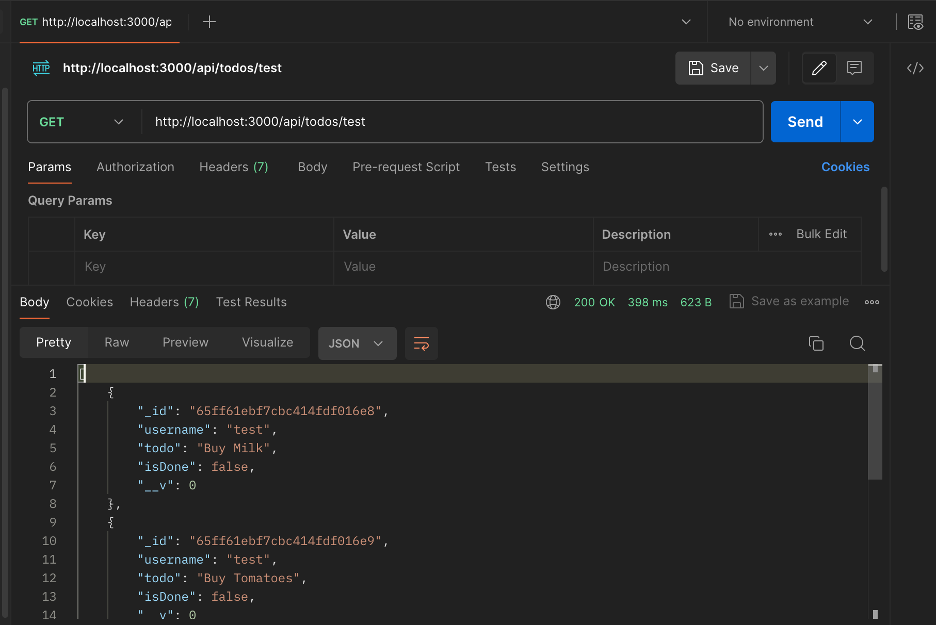
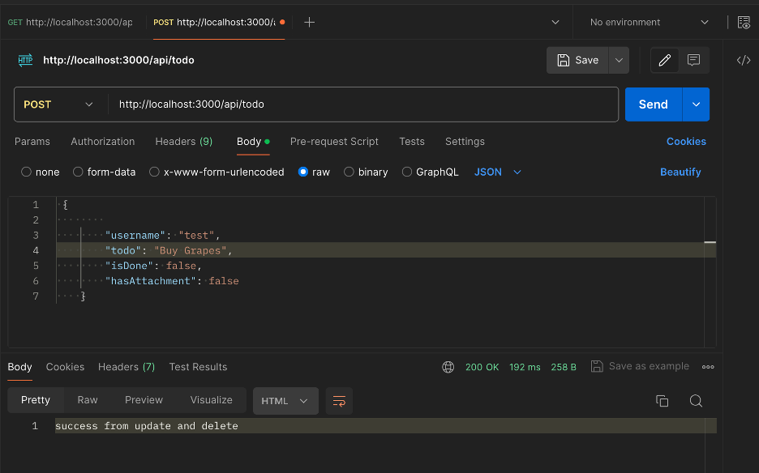
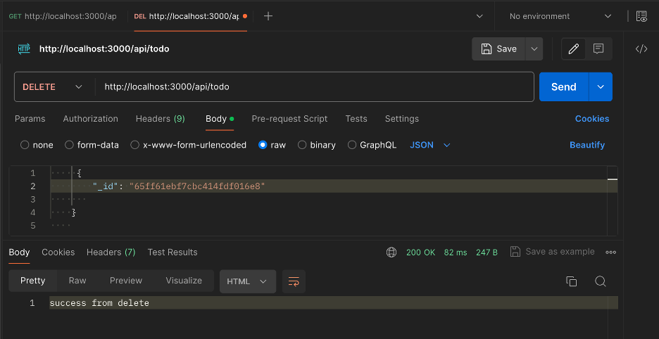
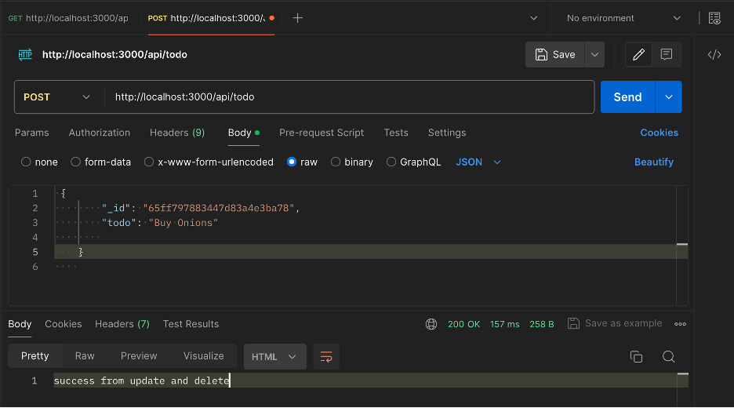

# About
This Todo API is designed to facilitate the management of todo tasks. It offers endpoints for creating, updating, retrieving, and deleting todos. Leveraging MongoDB as the underlying database and built with Node.js and Express framework, this API provides a robust solution for todo list management.

## Installation
```
git clone <repository-url>
cd <repository-folder>
npm install
```
## Dependencies
```
npm install body-parser --save
npm install express --save
npm install mongodb --save
npm install mongoose --save
npm install nodemon --save

```
Now a server is running on the Pi. If you plug in a Pico to the USB it will install the client code on the pico within 6 sec and make it a remote serial port.

`/dev/pts/pty1`

It's that easy to setup a remote serial port. Each time you plug in a pico, it will be the next `ptyN` on the list.

If you haven't already installed npm:
```
sudo apt update
sudo apt install nodejs npm
```
## Visual Overview
* Checkout the testing results from PostMan.
    
    
    
    
## Error Handling 
* If an error occurs during processing, the API will respond with an appropriate error message and an HTTP status code indicating the error.

